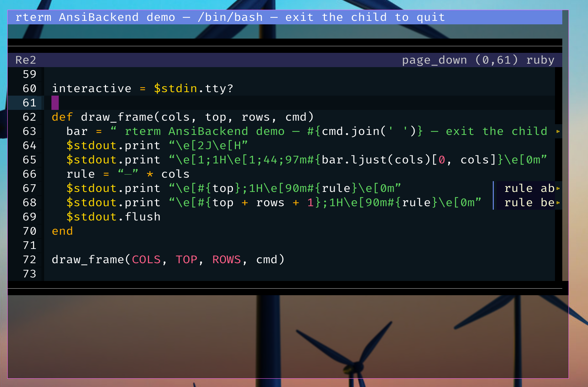

# rubyterm

A terminal emulator written **entirely in Ruby** — including a pure-Ruby
X11 client to talk to the X server and a pure-Ruby font renderer.

There is no C extension and no libvte; the escape-sequence interpreter, the screen buffer, the rendering and the
X11 protocol handling are all Ruby.

It is still rough and opinionated, but it now runs as an installable gem
with a `rubyterm` executable, renders with a damage-driven pipeline
(scrollback, text selection/copy, truecolor and UTF-8 all work), and is
split into a reusable terminal *engine* that can be driven without X11 at
all.

> **NOTE**: Escape-code coverage is partial (VT100/VT102 plus a useful chunk of xterm), font handling is
> basic, and the keymap is limited. It is *slow*, though it is my main driver. Full-screen apps mostly work; some will
> still misbehave. I have specific ideas about direction, so if you'd like
> to contribute, **talk to me first** (vidar@hokstad.com) or fork — I won't
> promise to merge changes we haven't discussed.

## Getting started

rubyterm is a **standalone X11 terminal emulator** — like `xterm` or any
other terminal, but written entirely in Ruby. You run it inside a running X
session and it opens a window with a shell in it.

    gem install rubyterm

Then, from within an X session (`$DISPLAY` must point at your X server):

    rubyterm                  # your $SHELL in a new window
    rubyterm bash -lc htop    # ...or run a specific command

Launch it however you launch any other terminal — from your window manager's
menu or a keybinding, from your X startup file, or from an existing terminal.

**Tabs?** Not yet — rubyterm is one terminal per window. For multiple
sessions, open several windows or run `tmux`/`screen` inside it.

## Screenshots of Ruby-in-Ruby-in-Ruby-...



This shows Rubyterm running on my [Ruby based WM](https://github/vidarh/rubywm), running [Rubyterm with a text-based-backend](examples/) that renders a a terminal *to text* (so it can run in any terminal), running my [editor Re](https://github.com/vidarh/re) editing the Rubyterm example. The text is rendered using the pure-Ruby TrueType font renderer [Skrift](https://github.com/vidarh/re), and connected to my X11 server using the [Pure-X11](https://github.com/vidarh/ruby-x11) Ruby X11 bindings (no libX or XCB, just pure Ruby socket code).

## Architecture

The code is deliberately small and split along clean seams so the pieces
are independently usable and testable:

- **Engine** — the escape interpreter (`Term`), the damage tracker
  (`TrackChanges`), the columnar screen buffer (`TermBuffer`) and the
  escape/UTF-8 parsers. No pixels, no X11; drivable headlessly.
- **Backends** — anything implementing the small drawing interface:
  - `Window` — the pure-Ruby X11 backend (the real terminal);
  - `AnsiBackend` — re-emits to an ANSI/escape stream (run a terminal
    inside another terminal; see `examples/terminal_in_terminal.rb`);
  - `BitmapWindow` — rasterises glyphs with skrift into an in-memory RGB
    buffer (headless rendering / visual testing, PNG output).
- **Application** — `RubyTerm` (in `lib/rubyterm/app.rb`), which owns the
  X window, the pty controller and the input/blink/flush threads and wires
  the engine to the X11 backend. `bin/rubyterm` runs it.

Rendering is **damage-driven**: writing a cell only mutates the buffer and
bumps a per-cell generation; a flush walks the damage and redraws just the
changed cells. A flood of output (an accidental `cat` of a large file) is
*jump-scrolled* — interpreted across many chunks and painted once.

For the full picture and the rationale behind the layering, see:

- [`docs/architecture-review.md`](docs/architecture-review.md) — the
  architecture critique, the phased refactoring plan, and the Ruby
  performance notes (with measured results).
- [`docs/seams.md`](docs/seams.md) — the layer seams: the screen-operation
  API and the backend drawing protocol.

## Installation

**From RubyGems** — to use it:

```bash
gem install rubyterm
rubyterm                  # then run it inside an X session
```

**From source** — to hack on it:

```bash
git clone https://github.com/vidarh/rubyterm && cd rubyterm
bundle install
bundle exec rubyterm
```

[skrift](https://github.com/vidarh/skrift) — the pure-Ruby TrueType/OpenType
font renderer rubyterm draws its text with — and its companion plugins live in
one monorepo and are pulled from git. To build against a local checkout, set
one per-machine override at the monorepo root (kept out of the repo):

```bash
bundle config set --global disable_local_branch_check true
bundle config set --global local.skrift /path/to/skrift
```

## Configuration

Configuration is read from `~/.config/rterm/config.toml` (TOML). See
[`example-config.toml`](example-config.toml) for a complete example. If the
file is absent, defaults are used.

- **`shell`** — path to the shell to launch. Defaults to `$SHELL`, then
  `/bin/sh`. Example: `shell = "/bin/bash"`.
- **`fonts`** — fonts to use, in priority order; later fonts cover glyphs
  missing from earlier ones. Each entry may be a direct path
  (`"~/fonts/MyFont.ttf"`), a file in `~/.local/share/fonts/`, or a name
  resolved via `fc-match` (`"monospace"`, `"monospace:weight=bold"`).
- **`fontsize`** — font size in points (e.g. `fontsize = 24`).
- **`width`** / **`height`** — initial window size in pixels; the terminal
  grid is derived from it and the font cell size. Defaults to `1000 x 600`
  (~80×24 at the default font); on a big display, e.g. `width = 2000` /
  `height = 1200`.
- **`deccolm`** — how the 80/132-column DECCOLM switch is realised:
  `"font"` (rescale the glyph cell, the default) or `"window"` (ask the WM
  to resize).

```toml
shell = "/bin/zsh"
fonts = [
  "FiraCode-Regular.ttf",   # programming font
  "unifont-15.0.06.ttf",    # Unicode fallback
  "monospace"               # system fallback
]
fontsize = 24
```

## Development

```bash
rake test          # the minitest unit/integration suite
rake run           # run the terminal (alias for bin/rubyterm)
```

There is a deterministic **test harness** for terminal correctness: it
runs cases through the engine and an oracle (tmux), diffs the resulting
screen state, and gates regressions with a ratchet. It can also record and
replay real applications, and run an instrumented live terminal with a
debug socket.

```bash
ruby harness/cli.rb run   --case cases/synthetic/dch.bin --oracle tmux
ruby harness/cli.rb sweep --cases cases --oracle tmux --ratchet ratchet.json
```

- [`docs/harness.md`](docs/harness.md) — the harness guide, and
  [`docs/harness-quickstart.md`](docs/harness-quickstart.md) — from a glitch
  to a minimal repro.
- [`docs/state-schema.md`](docs/state-schema.md) — the JSON terminal-state
  dump schema.
- [`docs/debugging-live-render.md`](docs/debugging-live-render.md) —
  debugging live-terminal display corruption.
- [`docs/bench-baseline.md`](docs/bench-baseline.md) — the performance
  baseline used to gate the optimisation work.

## Direction

Where I want to take this:

- Keep the engine fully decoupled from the pty and X11 so Ruby applications
  can instantiate a "terminal" with an IO object as its interface — the
  first consumer being my own text editor — and package the engine as a
  gem. (The split exists; the gem and the editor migration are in progress.)
- Make the terminal complete enough to run most Unix command-line tools: a
  reasonably complete, Unicode-aware xterm/VT100.
- Keep the code **small but understandable**. Terseness is valued only
  while it preserves readability.

## Resources

- xterm control sequences: <https://invisible-island.net/xterm/ctlseqs/ctlseqs.html>
- XFree86 control sequences: <https://www.xfree86.org/current/ctlseqs.html>
